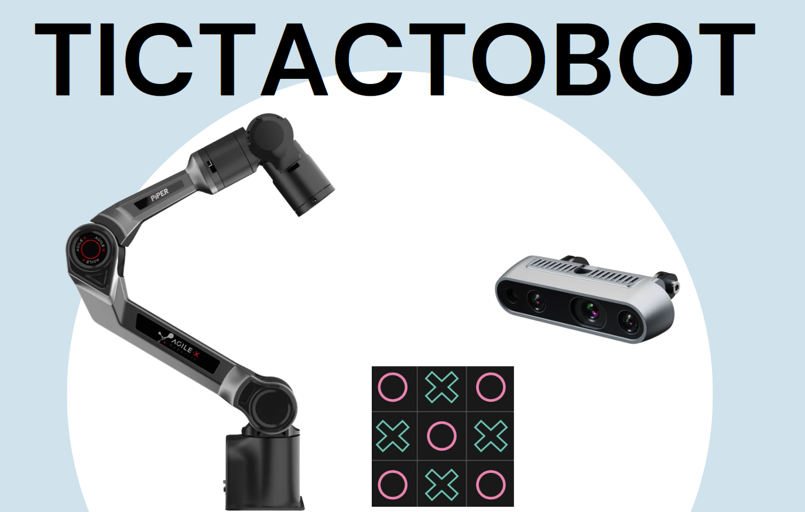
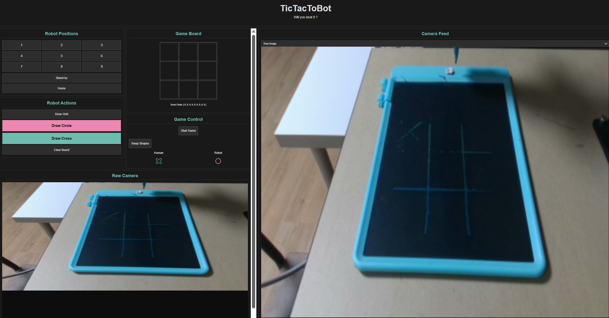
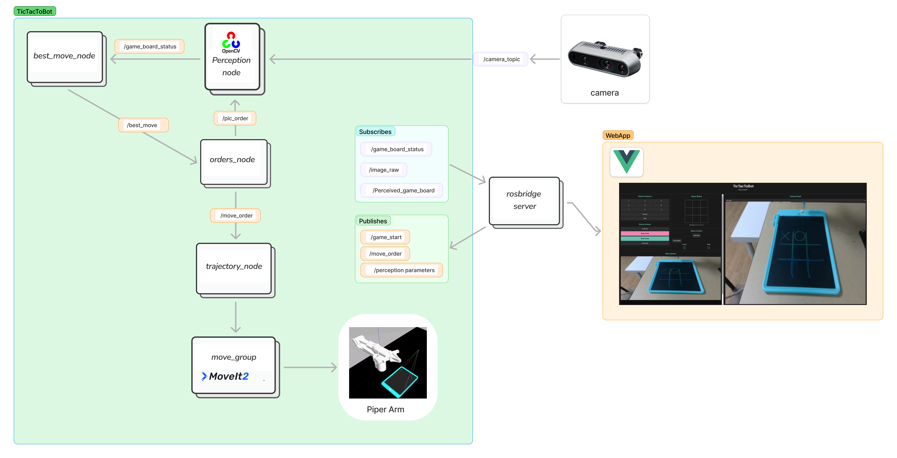

# Piper TicTacToe

A ROS2 project that lets the Piper robotic arm play Tic Tac Toe against humans using computer vision and AI.

## Overview

The robot uses a minimax algorithm to make optimal moves, OpenCV for board detection, and MoveIt for trajectory planning. It can draw X's and O's on a physical or simulated board.



## Components

- **trajectory_node**: Motion planning with MoveIt to draw shapes on the board
- **best_move_node**: AI decision-making (minimax algorithm)
- **perception_node**: Camera perception with OpenCV for board state recognition
- **orders_node**: Game orchestration node (connects everything)

## Setup

### Requirements
- ROS2 (Humble or later)
- MoveIt
- OpenCV
- Piper robot (real or Gazebo sim)

### Quick Start

#### Start Webapp:
**WebApp:**
```bash
./setup_scripts/webpage-ROSBrige_run.sh
```

#### Then run the game:

**Simulation:**
```bash
./setup_scripts/simulation/all_sim_launch.sh
```

**Real Robot:**
```bash
./setup_scripts/real_robot/real-robot_bringup.sh
```

## Web Interface

A simple web dashboard for controlling the game.



## System Architecture



## How It Works
1. Camera takes a picture of the board
2. best_move_node (Minimax algorithm) calculates the best move
3. Robot draws the selected shape (X or O)
4. Repeat until someone wins

## Notes

- Adjust grid positions in `piper_move_orders.cpp` for different board sizes
- Some parts still need cleanup (sorry about that 😁)

## License

MIT
